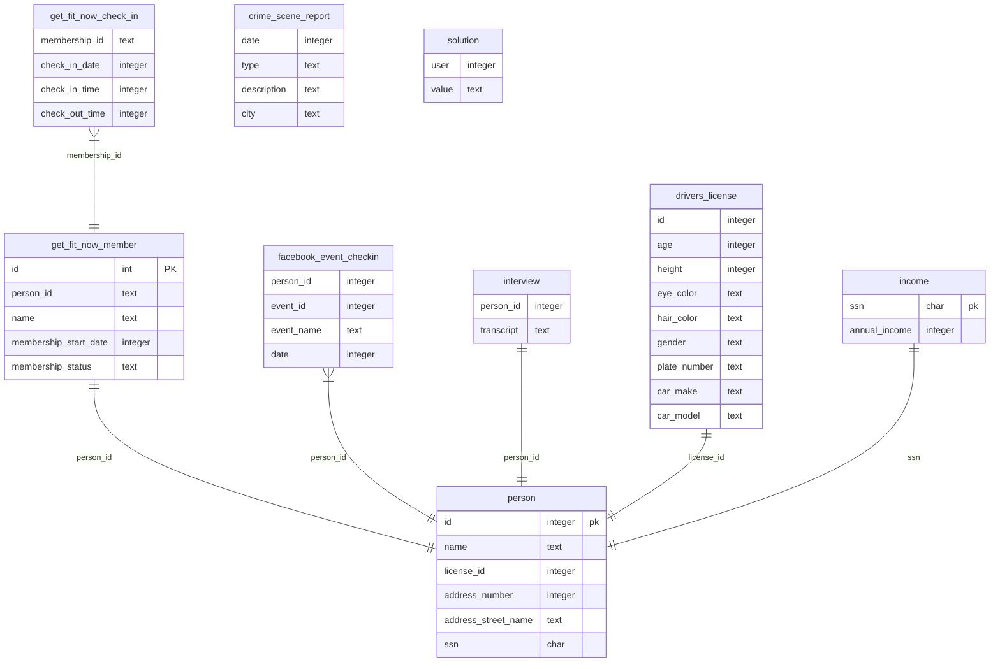

```mermaid
erDiagram
    get_fit_now_check_in {
        membership_id text
        check_in_date integer
        check_in_time integer
        check_out_time integer
    }
    get_fit_now_member {
        id int PK
        person_id text
        name text
        membership_start_date integer
        membership_status text
    }
    facebook_event_checkin {
        person_id integer
        event_id integer
        event_name text
        date integer
    }
    crime_scene_report {
        date integer
        type text
        description text
        city text
    }
    interview {
        person_id integer
        transcript text
    }
    person {
        id integer pk
        name text
        license_id integer
        address_number integer
        address_street_name text
        ssn char
    }
    drivers_license {
        id integer
        age integer
        height integer
        eye_color text
        hair_color text
        gender text
        plate_number text
        car_make text
        car_model text
    }
    income {
        ssn char pk
        annual_income integer
    }
    solution {
        user integer
        value text
    }
    
    get_fit_now_check_in }|--|| get_fit_now_member : "membership_id"
    get_fit_now_member ||--|| person : "person_id"
    facebook_event_checkin }|--|| person : "person_id"
    interview ||--|| person : "person_id"
    drivers_license ||--|| person : "license_id"
    income ||--|| person : "ssn"

```
